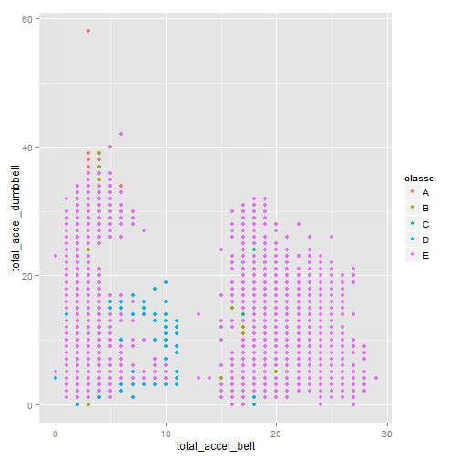
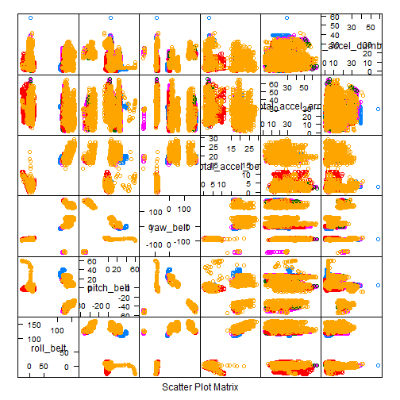

## Abstract 

A model was fit for the accelerometer information on the belt, forearm arm and dumbbell of 6 participants. Several barbell lifts were performed correctly (classe=A) and incorrectly in different ways (classe=B to E). Training and testing data sets were provided in download links. A predictive model was fit using training data and then used to predict the classe field in 20 records. Since the testing information does not have the classe its not possible to state exactly how accurate the prediction is but its calculated in 85%.  


## Background
  
Using devices such as Jawbone Up, Nike FuelBand, and Fitbit it is now possible to collect a large amount of data about personal activity relatively inexpensively. These type of devices are part of the quantified self movement - a group of enthusiasts who take measurements about themselves regularly to improve their health, to find patterns in their behavior, or because they are tech geeks. One thing that people regularly do is quantify how much of a particular activity they do, but they rarely quantify how well they do it. In this project, your goal will be to use data from accelerometers on the belt, forearm, arm, and dumbell of 6 participants. They were asked to perform barbell lifts correctly and incorrectly in 5 different ways. More information is available from the website [here](http://groupware.les.inf.puc-rio.br/har). (see the section on the Weight Lifting Exercise Dataset).   
  
## Objective
The goal of your project is to predict the manner in which they did the exercise. This is the "classe" variable in the training set. You may use any of the other variables to predict with. You should create a report describing how you built your model, how you used cross validation, what you think the expected out of sample error is, and why you made the choices you did. You will also use your prediction model to predict 20 different test cases.  

## Getting Data

```
## Loading required package: lattice
## Loading required package: ggplot2
## Loading required package: survival
## Loading required package: splines
## 
## Attaching package: 'survival'
## 
## The following object is masked from 'package:caret':
## 
##     cluster
## 
## Loading required package: parallel
## Loaded gbm 2.1
```

The following R commands are to download training and test set for the study.

```r
rawTraining <- read.table("C:\\TestR\\JHS_Machine_Learning\\pml-training.csv", sep=",", header=T)
rawTesting <- read.table("C:\\TestR\\JHS_Machine_Learning\\pml-testing.csv", sep=",", header=T)
```

## Preprocessing

A quick review of a summary(rawTraining) output, reveals that many of the 159 variables are actually summary variables: if variable name starts with the following: avg_, stddev_, var_, max_, min_, skewness_, amplitude_, or kurtosis_ should not be taken into account. In fact the new_window variable divides 406 records with values in this summary statistics and 19216 with the actual raw data where all the summary variables are either null or empty.  

So, preprocessing will be taking only the new_windows='no' records, only variables not starting with those names also variables as X and new_windows variable since we dont want those to be included in the predictive model.


```r
variables <- names(rawTraining)
sumVariables <- subset(variables, regexpr("^avg_.", variables)>0 | regexpr("^stddev_.", variables)>0 | regexpr("^var_.", variables)>0 | regexpr("^max_.", variables)>0 | regexpr("^min_.", variables)>0 | regexpr("^skewness_.", variables)>0 | regexpr("^amplitude_.", variables)>0 | regexpr("^kurtosis_.", variables)>0 )

training <- rawTraining[rawTraining$new_window=="no", !variables %in% c(sumVariables, "new_window","X")]
testing <- rawTesting[rawTesting$new_window=="no", !variables %in% c(sumVariables, "new_window","X")]
```

## Exploratory Analysis

Exploratory analysis shows that most of the values are in classe E, followed by D. Charts also show that classe do seem to create clusters but nothing near linear associations.  
Thus, the method selected to fit this set will be **Boosting**  


```r
qplot(total_accel_belt, total_accel_dumbbell, colour=classe, data=training)  
```

 

```r
featurePlot(x=training[c("roll_belt", "pitch_belt", "yaw_belt","total_accel_belt", "total_accel_arm", "total_accel_dumbbell")], y=training$classe, plot="pairs")
```

 

## Model Fit and cross validation

This commands will fit with the **Boosting** model with the following parameters:  
1. Method: "gbm"  
2. PreProcess: Principal Component Analysis  
3. Validation: Bootstrapping (default)  
4. folds: 25  (default)  
5. resampling: 25  (default)  
   
The principal component analysis is set to measure up to 90% of variations to avoid overfitting of the training set. Since many values are negative it won't be possible to apply logarithms so normal numeric values will be used. This results in a total of 19 components for the desired accuracy.  
  
Then the PC model is used as source for the boosting algorithm which will use bootstrapping as the cross validation method with 25 folds and 25 resamples.
  

```r
preProc <- preProcess (training[,5:57], method="pca" ,thresh = 0.90)
preProc
```

```
## 
## Call:
## preProcess.default(x = training[, 5:57], method = "pca", thresh = 0.9)
## 
## Created from 19216 samples and 53 variables
## Pre-processing: principal component signal extraction, scaled, centered 
## 
## PCA needed 19 components to capture 90 percent of the variance
```

```r
trainPC <- predict(preProc, training[,5:57])
modelFit2 <-train(training$classe ~ . , method="gbm", data=trainPC, verbose=F)
```

```
## Loading required package: plyr
```

```r
testPC <- predict(preProc, testing[,5:57])
```
  
**Model Fit Results:**  


```r
modelFit2
```

```
## Stochastic Gradient Boosting 
## 
## 19216 samples
##    18 predictor
##     5 classes: 'A', 'B', 'C', 'D', 'E' 
## 
## No pre-processing
## Resampling: Bootstrapped (25 reps) 
## 
## Summary of sample sizes: 19216, 19216, 19216, 19216, 19216, 19216, ... 
## 
## Resampling results across tuning parameters:
## 
##   interaction.depth  n.trees  Accuracy  Kappa  Accuracy SD  Kappa SD
##   1                   50      0.5       0.4    0.006        0.008   
##   1                  100      0.6       0.5    0.006        0.008   
##   1                  150      0.6       0.5    0.005        0.007   
##   2                   50      0.6       0.5    0.006        0.008   
##   2                  100      0.7       0.6    0.005        0.007   
##   2                  150      0.7       0.7    0.005        0.006   
##   3                   50      0.7       0.6    0.007        0.009   
##   3                  100      0.8       0.7    0.005        0.007   
##   3                  150      0.8       0.7    0.005        0.006   
## 
## Tuning parameter 'shrinkage' was held constant at a value of 0.1
## Accuracy was used to select the optimal model using  the largest value.
## The final values used for the model were n.trees = 150,
##  interaction.depth = 3 and shrinkage = 0.1.
```
  
** Prediction Results:
  
The fitted model now will be used to predict the 20 records in the testing sample.
The expected accuracy is of about 85%. That is: about 2 error in 20 records.
  

```r
predict(modelFit2, testPC)
```

```
##  [1] B A A A A E D D A A A C B A E E A B D B
## Levels: A B C D E
```

